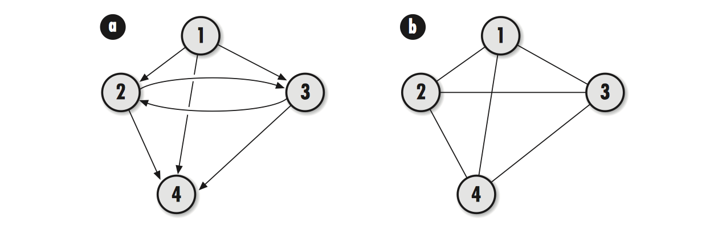

title: Matserting Algorithms with C-7: 图
date: 2017-04-02
tags: 算法, C, 图, 数据结构


### 图(Graphs)



图由**顶点**(vertices)和**边**(edges)组成, 图的边分为**有向**和**无向**

图表示为`G=(V, E)`, V 代表顶点的集合, E 和 V 是一种二元关系

> 有向图: V={1, 2, 3, 4} 和 E = {(1, 2), (1, 3), (1, 4), (2, 3), (2, 4), (3, 2), (3, 4)}

> 无向图: V={1, 2, 3, 4} 和 E = {(1, 2), (1, 3), (1, 4), (2, 3), (2, 4), (3, 4)}

> 有向图中`(1, 2)`代表中顶点 `1`指向顶点`2`

图中两个重要关系是**邻接**(adjacency)和**关联**(incidence)

> 无向图中, 顶点相连就是邻接, 而在有向图中, 只有两个顶点都相互指向对方是才是邻接的, 上图 1 和 2 就不邻接

> 关联是指顶点和边之间的关系. 有向图`(1, 2)`中称`1`关联到`2`, 无向图都是相互关联的

> 顶点的入度(in-degree)是指以顶点为终点的边的数目

> 顶点的出度(out-degree)是指以顶点为起点的边的数目

> 无向图中入度和出度都指顶点边的数目

**路径**是依次遍历顶点序列之间的边所形成的轨迹. 如果存在一条`u`到`u<sup>'</sup>`的路径, 则称`u`到`u<sup>'</sup>`是可达的. 没有重复顶点的路径称为**简单路径**

如果从某顶点出发, 最后能够返回该顶点, 则称该路径为**环**

如果图中的每个顶点都能通过某条路径到达其他顶点, 对于无向图则称为**连通**, 对有向图称为**强连通**. 如果只有图中部分是连通的, 无向图中称为**连通分支**, 有向图中称为**强连通分支**. 如果移除某个结点, 使得图或分支推动连通性, 则称该顶点为**关结点**. 如果移除某条边使得图失去连通性, 则称该边为**桥**

计算机中通常使用**邻接链表**(adjacency-list representation)来表示图. 邻接表按照链表的方式组织, 链表中的每个结构都包含两个成员: 一个顶点和与该顶点邻接的顶点所组成的一个邻接表

有向图中, 邻接表的顶点总数同总的边数相等; 无向图中, 邻接表的顶点总数是边的两倍


- **搜索方法**

#### 广度优先算法(breadth-first search)

在进一步探索图中的顶点之前先访问当前顶点的所有邻接结点.

> 1. 开始前, 首先选择一个起始顶点并将其涂成灰色, 而其他顶点为白色. 然后把起始点单独置于一个队列中.  
> 2. 对于队列中的每个顶点(初始状态下只有起始顶点), 依次找出和队列首部顶点相邻接的顶点, 将其涂成灰色然后加入到队列末尾.  
> 3. 将队列首部顶点涂黑表示已经访问过, 然后出队; 继续访问下一个首部顶点, 回到第 3 步继续查找相邻接的顶点; 如果相邻接的顶点是白色, 表示还没有发现它, 将其涂成灰色, 并把它入队到末尾.  
> 4. 直到队列中没有任何顶点时, 完成搜索


#### 深度优先算法(depth-first search)

在访问某个顶点后, 递归地访问此顶点的所有未访问过的相邻顶点, 尽可能深的持续探索直到无法继续为止

> 1. 选择一个起始点并涂成灰色加入到栈中, 其他顶点涂为白色.  
> 2. 查找该顶点所有的邻接顶点, 如果是白色表示尚未发现该顶点, 则把该顶点涂成灰色并加入到栈中.  
> 3. 最后加入也即是栈顶的顶点, 以该顶点为起始点重复第 2 步; 这样依次循环递归第 2 和 3 步骤, 直到栈顶邻接的顶点全涂成灰色, 或是没有邻接的顶点
> 4. 当栈顶顶点没有邻接时或是邻接全是灰色时, 将栈顶涂成黑色, 表示已经访问过该顶点, 然后将其出栈.  
> 5. 对栈顶重复第 2, 3, 4 步骤, 直到所有的顶点都出栈.  
> 6. 当栈中所有顶点都出栈后, 如果图中还有白色顶点, 则选择其中的任意一个作为起始点, 从第 2 步骤开始, 直至图中所有的顶点都被涂成黑色


图抽象数据类型头文件

```c
/* graph.h */
#ifndef GRAPH_H
#define GRAPH_H

#include <stdlib.h>
#include "list.h"
#include "set.h"

/* 邻接链表顶点结构 */
typedef struct AdjList_ {
    /* 顶点数据 */
    void *vertex;
    /* 邻接顶点集合 */
    Set adjacent;
}AdjList;

/* 图结构 */
typedef struct Graph_ {
    /* 图中顶点数量 */
    int vcount;
    /* 图中边的数量 */
    int ecount;

    int (*match)(const void *key1, const void *key2);
    void (*destroy)(void *data);
    /* 链表 */
    List adjlists;
}Graph;

typedef enum VertexColor_ {white, gray, black} VertexColor;
/* 初始化 */
void graph_init(Graph *graph, int (*match)(const void *key1, const void *key2),
    void (*destroy)(void *data));
/* 销毁 */
void graph_destroy(Graph *graph);
/* 插入顶点 */
int graph_ins_vertex(Graph *graph, const void *data):
/* 在 data1 和 data2 中建立邻接关系 */
int graph_ins_edge(Graph *graph, const void *data1, const void *data2);
/* 删除顶点 */
int graph_rem_vertex(Graph *graph, void **data);
/* 删除边 */
int graph_rem_edge(Graph *graph, void **data);
/* 取得顶点的邻接表 */
int graph_adjlist(const Graph *graph, const void *data, AdjList **adjlist);
/* 判断 data2 是否是 data1 的邻接点 */
int graph_is_adjacent(const Graph *graph, const void *data1, const void *data2);

#define graph_adjlists(graph) ((graph)->adjlists)
#define graph_vcount(graph) ((graph)->vcount)
#define graph_ecount(graph) ((graph)->ecount)

#endif
```

图的实现

```c
/* graph.c */
#include <stdlib.h>
#include <string.h>
#include "graph.h"
#include "list.h"
#include "set.h"

/* 初始化 */
void graph_init(Graph *graph, int (*match)(const void *key1, const void *key2),
    void (*destroy)(void *data))
{
    graph->vcount = 0;
    graph->ecount = 0;
    graph->destroy = destroy;
    graph->match = match;
    /* 初始化图链表 */
    list_init(&graph->adjlists, NULL);
}

/* 销毁 */
void graph_destroy(Graph *graph)
{
    AdjList *adjlist;

    /* 删除每一个顶点 */
    while (list_size(&graph->adjlists) > 0) {
        /* 删除链表结点 */
        if (list_rem_next(&graph->adjlists, NULL, (void **)&adjlist) == 0) {
            /* 释放顶点的邻接顶点 */
            set_destroy(&adjlist->adjacent);
            if (graph->destroy != NULL) {
                graph->destroy(adjlist->vertex);
            }
            free(adjlist);
        }
    }
    /* 删除链表 */
    list_destroy(&graph->adjlists);
    memset(graph, 0, sizeof(Graph));
}

int graph_ins_vertex(Graph *graph, const void *data)
{
    ListElmt *element;
    AdjList *adjlist;
    int retval;

    /* 确认没有重复数据存在图中链表里 */
    for (element = list_head(&graph->adjlists); element != NULL;
        element = list_next(element)) {
        if (graph->match(data, ((AdjList *)list_data(element))->vertext)) {
            return -1;
        }
    }
    /* 顶点内存 */
    if ((adjlist = (AdjList *)malloc(sizeof(AdjList))) == NULL) {
        return -1;
    }
    adjlist->vertex = (void *)data;
    /* 初始化新顶点邻接点 */
    set_init(&adjlist->adjacent, graph->match, NULL);
    /* 将新顶点插入到链表尾部 */
    if ((retval = list_ins_next(&graph->adjlists, list_tail(&graph->adjlists),
        adjlist)) != 0) {
        return retval;
    }
    /* 增加顶点数量 */
    graph->vcount++;
    return retval;
}

int graph_ins_edge(Graph *graph, const void *data1, const void *data2)
{
    ListElmt *element;
    int retval;

    /* 查找是否存在顶点数据 data2 */
    for (element = list_head(&graph->adjlists); element != NULL; 
        element = list_next(element)) {
        if (graph->match(data2, ((AdjList *)list_data(element))->vertex)) {
            break;
        }
    }
    /* 顶点不存在 */
    if (element == NULL) {
        return -1;
    }

    /* 查找是否存在顶点数据 data1 */
    for (element = list_head(&graph->adjlists); element != NULL; 
        element = list_next(element)) {
        if (graph->match(data1, ((AdjList *)list_data(element))->vertex)) {
            break;
        }
    }
    /* 顶点不存在 */
    if (element == NULL) {
        return -1;
    }
    /* 插入边关系集合 
     * 邻接点集合里结点数据指向实际的数据, 而不是顶点结构
     */
    if ((retval = set_insert(&((AdjList *)list_data(element)->adjacent, data2))) != 0) {
        return retval;
    }
    graph->ecount++;
    return 0;
}
/* 删除顶点 */
int graph_rem_vertex(Graph *graph, void **data)
{
    ListElmt *element, *temp, *prev = NULL;
    AdjList *adjlist;
    int found = 0;

    /*遍历链表中所有顶点, 找到匹配的顶点和邻接点 */
    for (element = list_head(&graph->adjlists); element != NULL;
        element = list_next(element)) {
        /* 当该顶点是其他顶点的邻接点时, 不允许删除 */
        if (set_is_memember(&((AdjList *)list_data(element))->adjacent, *data)) {
            return -1;
        }
        /* 找到匹配的顶点位置 */
        if (graph->match(*data, ((AdjList *)list_data(element))->vertex)) {
            temp = element;
            found = 1;
        }
        if (!found) {
            prev = element;
        }
    }
    /* 未找到符合顶点 */
    if (!found) {
        return -1;
    }
    /* 不能删除有还有邻接点的顶点 */
    if (set_size(&((AdjList *)list_data(temp))->adjacent) > 0) {
        return -1;
    }
    /* 删除顶点 */
    if (list_rem_next(&graph->adjlists, prev, (void **)&adjlist) != 0) {
        return -1;
    }

    *data = adjlist->vertex;
    free(adjlist);

    graph->vcount--;
    return 0;
}

int graph_rem_edge(Graph *graph, void *data1, void *data2)
{
    ListElmt *element;
    /* 查找第一个顶点 */
    for (element = list_head(&graph->adjlists); element != NULL;
        element = list_next(element)) {
        if (graph->match(data1, ((AdjList *)list_data(element))->vertex)) {
            break;
        }
    }

    if (element == NULL) {
        return -1;
    }
    /* 将顶点的邻接边删除 */
    if (set_remove(&((AdjList *)list_data(element))->adjacent, data2) != 0) {
        return -1;
    }

    graph->ecount--;
    return 0;
}
/* 取得顶点 */
int graph_adjlist(const Graph *graph, const void *data, AdjList **adjlist)
{
    ListElmt *element, *prev = NULL;
    /* locate the adjacency list for the vertex */
    for (element = list_head(&graph->adjlists); element != NULL;
        element = list_next(element)) {
        if (graph->match(data, ((AdjList *)list_data(element))->vertex)) {
            break;
        }
        prev = element;
    }
    /* return if the vertex was not found */
    if (element == NULL) {
        return -1;
    }
    /* pass back the adjacency list for the vertex */
    *adjlist = list_data(element);
    return 0;
}
/* 判断邻接关系 */
int graph_is_adjacent(const Graph *graph, const void *data1, const void *data2)
{   
    ListElmt *element, *prev = NULL

    for (element = list_head(&graph->adjlists); element != NULL;
        element = list_next(element)) {
        if (graph->match(data1, ((AdjList *)list_data(element))->vertex)) {
            break;
        }
        prev = element;
    }

    if (element == NULL) {
        return -1;
    }
    return set_is_memember(&((AdjList *)list_data(element))->adjacent, data2);
}
```

图的应用: 计算网络跳数(Counting Network Hops)


使用广度优先算法, 对于某个顶点的的邻接点, 其邻接点的跳数都等于该顶点跳数加上 1

```c
/* bfs.c */
#include <string.h>
#include "graph.h"
#include "list.h"
#include "queue.h"
#include "set.h"


/* define a struct for vertices in a breadth-first search */
typedef struct BfsVertext_ {
    void *data;
    /* 顶点颜色 */
    VertexColor color;
    int hops;
}BfsVertex;

int bfs(Graph *graph, BfsVertex *start, List *hops)
{
    Queue queue;
    AdjList *adjlist, *clr_adjlist;
    BfsVertex *clr_vertex, *adj_vertex;
    ListElmt *element, *member;

    /* 初始化顶点颜色 */
    for (element = list_head(&graph_adjlists(graph)); element != NULL;
        element = list_next(element)) {
        clr_vertex = ((AdjList *)list_data(element))->vertex;
        if (graph->match(clr_vertex, start)) {
            /* 确定起点 */
            clr_vertex->color = gray;
            clr_vertex->hops = 0;
        } else {
            clr_vertex->color = white;
            clr_vertex->hops = -1;
        }
    }
    /* 取得起始顶点 */
    if (graph_adjlist(graph, start, &clr_adjlist) != 0) {
        return -1;
    }

    /* 将起始点加入队列中 */
    queue_init(&queue, NULL);
    if (queue_enqueue(&queue, clr_adjlist) != 0) {
        queue_destroy(&queue);
        return -1;
    }
    /* 循环队列, 广度优先 */
    while (queue_size(&queue) > 0) {
        adjlist = queue_peek(&queue);
        /* 循环邻接点 */
        for (member = set_head(&adjlist->adjacent); member != NULL;
            member = member->next) {
            /* 注意集合结点存储的数据指向并不是一个顶点, 而是顶点指向的实际数据 */
            adj_vertex = set_data(member);
            /* 确认顶点存在于图中 */
            if (graph_adjlist(graph, adj_vertex, &clr_adjlist) != 0) {
                queue_destroy(&queue);
                return -1;
            }
            clr_vertex = clr_adjlist->vertex;

            if (clr_vertex->color == white) {
                /* 如果顶点还没有添加到队列中, 将其涂成灰色并加入到队列里 */
                clr_vertex->color = gray;
                /*  队列首部顶点到达这个顶点所需跳数 + 1, 也即是起始点到该点的跳数 */
                clr_vertex->hops = ((BfsVertex *)adjlist->vertex)->hops + 1;

                if (queue_enqueue(&queue, clr_adjlist) != 0) {
                    queue_destroy(&queue);
                    return -1;
                }
            }
        }
        /* 队首部出队, 涂成黑色 */
        if (queue_dequeue(&queue, (void **)&adjlist) == 0) {
            ((BfsVertex *)adjlist->vertex)->color = black;
        } else {
            queue_destroy(&queue);
            return -1;
        }
    }
    /* 完成循环成销毁队列 */
    queue_destroy(&queue);
    /* 初始一个队列 hops */
    list_init(hops, NULL);
    for (element = list_head(&graph_adjlist(graph)); element != NULL;
        element = list_next(element)) {
        clr_vertex = ((AdjList *)list_data(element))->vertex;
        /* 对于 hops 值为即为到达该顶点所需最少跳数, -1 是不可到达的顶点 */
        if (clr_vertex->hops != -1) {
            if (list_ins_next(hops, list_tail(hops), clr_vertex) != 0) {
                list_destroy(hops);
                return -1;
            }
        }
    }
    return 0;
}
```

图的应用: 拓扑排序(Topological Sorting)


```c
/* dfs.c */
#include <stdlib.h>
#include "graph"
#include "list.h"
#include "set.h"

typedef struct DfsVertex_ {
    void *data;
    VertexColor color;
}DfsVertex;

static int dfs_main(Graph *graph, AdjList *adjlist, List *ordered)
{
    AdjList *clr_adjlist;
    DfsVertex *clr_vertex, *adj_vertex;
    ListElmt *member;
    /* change the color of vertex to gray */
    ((DfsVertex *)adjlist->vertex)->color = gray;
    /* search its adjacency set */
    for (member = set_head(&adjlist->adjacent); member != NULL;
        member = member->next) {
        /* determine the color of the next adjacent vertex */
        adj_vertex = set_data(member);
        /* 取得该顶点 */
        if (graph_adjlist(graph, adj_vertex, &clr_adjlist) != 0) {
            return -1;
        }
        clr_vertex = clr_adjlist->vertex;
        /* move one vertex deeper when the next adjacent vertex is white */
        /* 如果顶点是白色, 表明还没被访问过, 如果有邻接点, 继续向下层访问 */
        if (clr_vertex->color == white) {
            if (dfs_main(graph, clr_adjlist, ordered) != 0) {
                return -1;
            }
        }
    }
    /* color the current vertex black and make it first in the list */
    ((DfsVertex *)adjlist->vertex)->color = black;

    if (list_ins_next(ordered, NULL, (DfsVertex *)adjlist->vertex) != 0) {
        return -1;
    }
    return 0;
}

int dfs(Graph *graph, List *ordered)
{
    DfsVertex *vertex;
    ListElmt *element;

    /* initial all of the vertices in the graph */
    for (element = list_head(&graph->adjlists); element != NULL;
        element = list_next(element)) {
        vertex = ((AdjList *)list_data(element))->vertex;
        vertex->color = white;
    }

    /* initialize list */
    list_init(ordered, NULL);
    /* perform depth-first search */
    for (element = list_head(&graph->adjlists); element != NULL;
        element = list_next(element)) {
        /* ensure that every component of unconnected graphs is searched */
        vertex = ((AdjList *)list_data(element))->vertex;
        if (vertex->color == white) {
            /* 确保所有顶点遍历到, 发生错误就退出 */
            if (dfs_main(graph, (AdjList *)list_data(element), ordered) != 0) {
                list_destroy(ordered);
                return -1;
            }
        }
    }
    return 0;
}

```