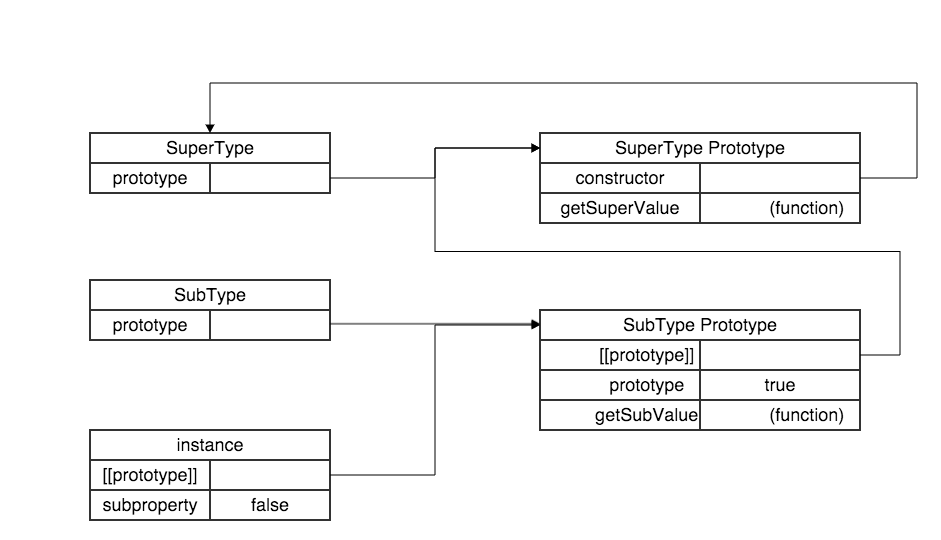

title: javascript
date: 2017-03-21


#### 对象属性特征

1.数据属性
`[[Configurable]]` 能否通过 `delete` 删除属性从而重新定义属性，能否修改属性，或者能否把属性修改为访问器属性
`[[Enumerable]]` 能否通过 `for-in` 循环返回属性
`[[Writable]]` 能否修改属性的值
`[[Value]]` 属性的数据值

2.访问器属性
`[[Configurable]]` 能否通过 `delete` 删除属性从而重新定义属性，能否修改属性，或者能否把属性修改为数据属性
`[[Enumerable]]` 能否通过 `for-in` 循环返回属性
`[[Get]]` 在读取属性时调用的函数
`[[Set]]` 在写入属性时调用的函数

#### 对象属性查找

每当代码读取某个对象的某个属性时，都会执行一次搜索，目标是具有给定名字的属性。

搜索首先从对象实例本身开始。如果在实例中找到了具有给定名字的属性，则返
回该属性的值；

如果没有找到，则继续搜索指针指向的原型对象，在原型对象中查找具有给定名字的属性。

--------------

#### 判断属性是否为对象本身属性或是在原型链中

`hasOwnProperty()` 方法断访问是属性是否是在实例中

`in` 操作符会在通过对象能够访问给富属性时返回 `true`，无论该属性存在于实例中还是原型中。

------

#### 函数原型

只要创建一个函数，就会根据一组特定的规则为该函数创建一个 `prototype` 属性，该属性指向函数的原型对象

默认的情况下，所有的原型对象都会自动获得一个 `constructor` (构造函数) 属性，这个属性包含一个指向 `prototype` 属性所在函数的指针

当调用构造函数创建一个新实例后，该实例的内部将包含一个指针（内部属性），指向函数的原型对象。ECMAScript 5把这个指针叫做 `[[prototype]]` ，通过`Object.getPrototypeOf()` 访问到这个指针，或是使用非标准属性 `__proto__`



-----------

#### 原型语法

**写法一**

```javascript
function Person() {
}
Person.prototype.name = "Nicholas";
Person.prototype.age = 29;
Person.prototype.job = "Software Engineer";
Person.prototype.sayName = function() {
    console.log(this.name);
}
```

**写法二**

```javascript
function Person() {
}
Person.prototype = {
    name: "Nicholas",
    age: 29,
    job: "Software Engineer",
    sayName: function() {
        console.log(this.name);
    }
}
```

**写法二**相当把 `Person.prototype` 重新指向新的对象

#### 1. 工厂模式

```javascript
function createPerson(name, age, job) {
    var o = new Object();
    o.name = name;
    o.age = age;
    o.job = job;
    o.sayName = function() {
        console.log(this.name);
    };
    return o;
}

var person1 = createPerson("Nicholas", 29, "Software Egineer");
var person2 = createPerson("Greg", 27, "Doctor");
```

#### 2.构造函数模式

```javascript
    fucntion Person(name, age, job) {
        this.name = name;
        this.age = age;
        this.job = job;
        this.sayName = function() {
            console.log(this.name);
        };
        // 等价 this.sayName = new Function("console.log(this.name)");
    }
    var person1 = new Person("Nicholas", 29, "Software Egineer");
    var person2 = new Person("Greg", 27, "Doctor");
    
    console.log(person1.sayName == person2.sayName); //false, 说明在两个对象中，sayName是不同的对象
```

#### 3.原型模式

```javascript
function Person() {
}
Person.prototype.name = "Nicholas";
Person.prototype.age = 29;
Person.prototype.job = "Software Engineer";
Person.prototype.sayName = function() {
    console.log(this.name);
};
    var person1 = new Person();
    person1.sayName();  //"Nicholas"
    
    var person2 = new Person();
    person2.sayName();  //"Nicholas"
    console.log(person1.sayName == person2.sayName); //true, 说明在两个对象中，sayName是相同的对象
```

#### 4.组合使用构造函数模式和原型模式

```javascript
function Person(name, age, job) {
    this.name = name;
    this.age = age;
    this.job = job;
    this.friend = ["Shelby", "Court"];
}

Person.prototype = {
    constructor: Person;
    sayName: function() {
        console.log(this.name);
    };
};

var person1 = new Person("Nicholas", 29, "Software Engineer");
var person2 = new Person("Greg", 27, "Doctor");

person1.friend.push("Van");
console.log(person1.friends);   //"Shelby, Count, Van"
console.log(person2.friends);       //"Shelby, Count"
console.log(person1.friends === person2.friends);   //false
console.log(person2.sayName === person2.sayName);   //true
```

#### 5.动态原型模式

```javascript
function Person(name, age, job) {
    this.name = name;
    this.age = age;
    this.job = job;
    
    if (typeof this.sayName != "function") {
        Person.prototype.sayName = function() {
            console.log(this.name);
        };
    }
}

var friend = new Person("Nicholas", 29, "Software Engineer");
friend.sayName();
```

#### 6.寄生构造函数模式

```javascript 
function Person(name, age, job) {
    var o = new Object();
    o.name = name;
    o.age = age;
    o.job = job;
    o.sayName = function() {
        console.log(this.name);
    };
    return o;
}

var friend = new Person("Nicholas", 29, "Software Engineer");
friend.sayName();       //"Nicholas"


```

> 构造函数在不返回值的情况下，默认会返回新对象实例  
> 而通过在构造函数的末尾添加一个 `return` 语句，可以重写调用构造函数时返回的值。  
> 这种模式可以在行列的情况下用来为对象创建构造函数。  
> 假如想创建一个具有额外方法的特殊数组，由于不能直接修改 `Array` 构造函数，可以使用这种模式

```javascript
function SpecialArray() {
    //创建数组
    var values = new Array();
    //添加值
    values.push.apply(values, arguments);
    //添加方法
    values.toPipedString = function() {
        return this.join("|");
    };
    //返回数组
    return values;
}

var colors = new SpecialArray("red", "blue", "green");
console.log(colors.toPipedString()); //"red|blue|green"
```

#### 7.稳妥构造函数模式

```javascript
function Person(name, age, job) {
    var o = new Object();
    
    o.sayName = function() {
        console.log(name);
    };
    return o;
}
```

#### 原型链

```javascript
function SuperType() {
    this.property = true;
    //something else
}
SuperType.prototype.getSuperValue = function() {
    //some codes
    return this.property;
};

function SubType() {
    //something
    this.subproperty = false;
}
//继承了 SuperType
SubType.prototype = new SuperType();
SubType.prototype.getSubValue = function() {
    return this.subproperty;
};
//other codes
var instance = new SubType();
console.log(instance.getSuperValue());      //true
```


#### 原型链继承的问题
- 创建子类型时，原先的超类型实例属性变成了子类的原型属性
- 创建子类型时，没有办法在不影响所有对象实例的情况下给超类型的构造函数传递对数

#### 继承方法
##### 1. 借用构造函数（伪造对象、经典继承）

```javascript 
function SuperType(newColor) {
    this.color = ["red", "blue", "green"];
}

function SubType() {
    //继承了 SuperType
    SuperType.call(this, "yellow")
}

var instance1 = new SubType();
instance1.colors.push("black");
console.log(instance1.colors);  //"red,blue,green,yellow,black"

var isntance1 = new SubType();
console.log(instance2.colors);  //"red,blue,green,yellow"
```

##### 2. 组合继承（伪经典继承）

```javascript
function SuperType(name) {
    this.name = name;
    this.colors = ["red", "blue", "green"];
}

SuperType.prototype.sayName = function() {
    console.log(this.name);
};

function SubType(name, age) {
    //继承属性
    SuperType.call(this, name);
    this.age = age;
}

//继承方法
SubType.prototype = new SuperType();
SubType.prototype.sayAge = function() {
    console.log(this.age);
};

var instance1 = new SubType("Nicholas", 29);
instance1.colors1.push("black");
console.log(instance1.colors);      //"red,blue,green,black"
instance1.sayName();    //"Nicholas"
instance.sayAge();      //29

var instance2 = new SubType("Greg", 27);
console.log(instance2.colors);  //"red,blue,green"
instance2.sayName();    //"Greg"
instance2.sayAge();     //27
```

##### 3. 原型式继承

```javascript
function object(o) {
    function F() {}
    F.prototype = o;
    return new F();
}

var person = {
    name: "Nicholas",
    friends: [
        "Shelby",
        "Court",
        "Van"
    ]
};

var anotherPerson = object(person);
anotherPerson.name = "Greg";
anotherPerson.friends.push("Rob");

var yetAnotherPerson = object(person);
yetAnotherPerson.name = "Linda";
yetAnotherPerson.friends.push("Barbie");
console.log(person.friends);  //"Shelby,Court,Van,Rob,Barbie"
```

> 使用 `Object.create()` 原型式继承。该函数接受两个参数：一个用作新对象原型的对象和一个（可选的）新对象定义额外属性的对象，覆盖原型卦象上的同名属性

- **使用一个参数**

```javascript
var person = {
    name: "Nicholas",
    friends: [
        "Shelby",
        "Court",
        "Van"
    ]
};

var anotherPerson = Object.create(person);
anotherPerson.name = "Greg";
anotherPerson.friends.push("Rob");

var yetAnotherPerson = Object.create(person);
yetAnotherPerson.name = "Linda";
yetAnotherPerson.friends.push("Barbie");
console.log(person.friends);  //"Shelby,Court,Van,Rob,Barbie"
```

- **使用两个参数，参数传入方式与 `Object.definePrototies()` 相同**

```javascript
var person = {
    name: "Nicholas",
    friends: [
        "Shelby",
        "Court",
        "Van"
    ]
};

var anotherPerson = Object.create(person, {
    name: {
        value: "Greg"
    }
});
console.log(anotherPerson.name);  //"Greg"
```

##### 4. 寄生式继承

```javascript
function createAnother(original) {
    //通过调用函数创建一个新对象
    var clone = Object.create(original);
    //以某种方式来增强这个对象
    clone.sayHi = function() {
        console.log("hi");
    };
    //返回该对象
    return clone;
}

var person = {
    name: "Nicholas",
    friends: [
        "Shelby",
        "Court",
        "Van"
    ]
};

var anotherPerson = createAnother(person);
anotherPerson.sayHi();  //"hi"

```

##### 5. 寄生组合式继承

```javascript
function inheritPrototype(subType, superType) {
    //创建对象
    var prototype = Object.create(superType.prototype);
    //增强对象
    prototype.constructor = subType;
    //指定对象
    subType.prototype = prototype;
}

function SuperType(name) {
    this.name = name;
    this.colors = ["red", "blue", "green"];
}

SuperType.prototype.sayName = function() {
    console.log(this.name);
};

function SubType(name, age) {
    SuperType.call(this, name);
    this.age = age;
}

inheritPrototype(SubType, SuperType);
SubType.prototype.sayAge = function() {
    console.log(this.age);
};

var instance = new SubType("Nicholas", 29);
```


